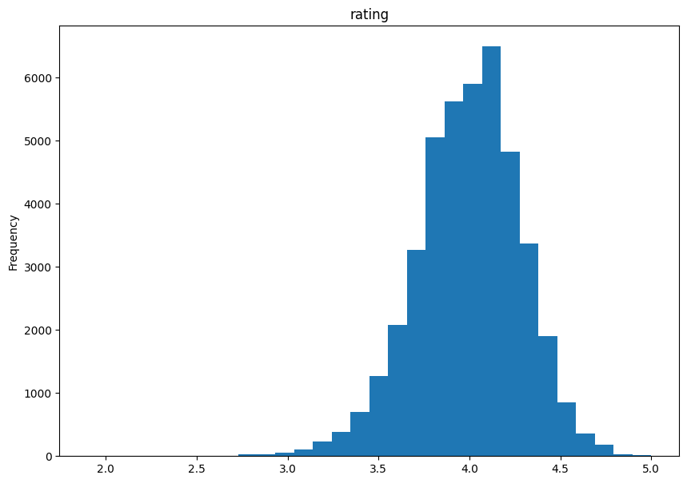

_This project is a team assignment for the "Data Mining" course of the [Department of Informatics](https://di.uoa.gr/en/) at [University of Athens](https://en.uoa.gr/)._

_This repository was not used during the development of the project. The project was developed in a private repository and was uploaded here after the official completion of the course._

## Description

This project is about creating a book recommendation system based on the Goodreads dataset. (The dataset can be found [here](https://zenodo.org/record/53894/files/goodreads10k.zip?download=1).)

We will focus on the following tasks:
- Preprocessing of the data
- Creating a recommendation system
- Classifying books into genres based on their descriptions
- Creating a content-based image retrieval system using the book covers
First, you will load the entire file into a dataframe and check if there are any NaN values in the columns, removing rows with such values from the dataframe. Next, you will write the appropriate Python commands to address the following tasks. In most cases, answers should be presented using a visualization, and you may use any Python library of your choice for this purpose.

## Contributors

<table>
  <tr>
    <td align="center"><a href="https://github.com/sfoto"><br /><sub><b>Spyros Fotopoulos</b></sub></a><br /></td>
    <td align="center"><a href="https://github.com/zoekoukouve"><br /><sub><b>Zoe Koukouve</b></sub></a><br /></td>
  </tr>
</table>


```python
# Linking google drive for easy access to files
from google.colab import drive
save_path = '/content/gdrive/'
drive.mount(save_path, force_remount=True)
save_path += 'MyDrive/DataMining/BookRecommendation/'
```

    Mounted at /content/gdrive/


# **Preprocessing**

After loading the dataset into a dataframe, we checked for any missing values (NaN) in the columns. Rows containing NaN values should be removed.


#### Task 1: Splitting **ratingsByStars**:

The column **ratingsByStars** contained five comma-separated values representing ratings, across the different star categories. These were split into separate columns named **ratingStar5**, **ratingStar4**, and so on.

#### Task 2: Extracting Primary Genre:

The **genres** column included multiple genres for each book in the form of a list. A new column, **genreSingle**, was created to store only the first genre from the list, for each one of the books. Rows without genre information were removed for consistency.


#### Task 3: Extracting Year from **publishDate**:

The **publishDate** column contained publication dates. We extracted the year of publication and stored it in a new column, **publishYear**.
These preprocessing steps prepared the data for further analysis, by ensuring it was clean, well-structured, and contained some additional derived features. All other columns, which were not deemed necessary for the tasks at hand, were removed.

_In between the tasks, we also performed some exploratory data analysis to better understand the dataset._


```python
# Imports
import pandas as pd
import numpy as np
import matplotlib.pyplot as plt
import seaborn as sns
from datetime import datetime, timedelta
import io

# Load data
data = pd.read_csv(save_path+'books_1.Best_Books_Ever.csv')

# Keep only useful columns
df = data[['bookId','ratingsByStars','publishDate','genres','rating','pages','title','author','language','description','coverImg']].copy()

# Print datatypes and a sample
print(df.dtypes)
df.head(5)
```

    bookId             object
    ratingsByStars     object
    publishDate        object
    genres             object
    rating            float64
    pages              object
    title              object
    author             object
    language           object
    description        object
    coverImg           object
    dtype: object


```python
# Let's remove rows with 'Nan'
df.dropna(inplace=True)
df.head(5)
```


```python
# Split 'ratingsByStars' to 5 columns
df = df[df["ratingsByStars"].str.contains("\[\]") == False].copy() # remove empty strings
df[['ratingStar5', 'ratingStar4', 'ratingStar3', 'ratingStar2', 'ratingStar1']] = df['ratingsByStars'].str.replace("\[\'",'').str.replace("\'\]",'').str.split("', '", expand = True).apply(pd.to_numeric)
df.drop('ratingsByStars', axis=1, inplace=True)
```


```python
# Greate genreSingle column
df = df[df["genres"].str.contains("\[\]") == False].copy() # remove empty strings
df['genreSingle'] = df['genres'].str.replace("\[\'",'').str.replace("\'\]",'').str.split("', '", expand = True)[0]
df.drop('genres', axis=1, inplace=True)
```


```python
# Convert 'publishDate' column to datetime
df['publishDate'] = pd.to_datetime(df['publishDate'], infer_datetime_format=True, errors='coerce')
df.dropna(inplace=True) # remove invalid dates

# Extract year from 'publishDate' column
df['publishYear'] = df['publishDate'].dt.year.astype(int)
df.drop('publishDate', axis=1, inplace=True)

# Fix misidentified years (ex. '72 should be 1972 and not 2072)
df.loc[df.publishYear > 2023, 'publishYear'] -= 100
```

# **Understanding the data**

The goal of this section was to gain a better understanding of the data at hand. For this we had to find some basic statistics about the dataset and display them in a meaningful way. Namely:

- Histogram of Ratings
- Top 10 Books by Page Count
- Top 10 Books by 5-Star Ratings
- Top 10 Authors by Book Count
- Books Published Per Year

### Histogram of Ratings
A histogram was created to better visualize the distribution of ratings across all books in the dataset (using the **rating** column).


```python
# plot layout/settings
fig, axes = plt.subplots()
fig.set_size_inches(10,7)

# plot data
column = "rating"
df[column].plot.hist(bins=30, title=column)
```


    

    


### Top 10 Books by Page Count
Identified the top 10 books with the highest number of pages. (using the **pages** column)


```python
# Convert pages to int
df['pages'] = pd.to_numeric(df['pages'], errors="coerce")
df.dropna(inplace=True)
df['pages'] = df['pages'].astype(pd.Int64Dtype())
top_10_pages = df.nlargest(10, 'pages').reset_index()
top_10_pages.index += 1
top_10_pages[['title', 'pages']]
```


  <div id="df-89ef7993-1cb2-4acf-8ff3-c61dbacabbce">
    <div class="colab-df-container">
      <div>
<style scoped>
    .dataframe tbody tr th:only-of-type {
        vertical-align: middle;
    }

    .dataframe tbody tr th {
        vertical-align: top;
    }

    .dataframe thead th {
        text-align: right;
    }
</style>
<table border="1" class="dataframe">
  <thead>
    <tr style="text-align: right;">
      <th></th>
      <th>title</th>
      <th>pages</th>
    </tr>
  </thead>
  <tbody>
    <tr>
      <th>1</th>
      <td>The Story of Civilization</td>
      <td>14777</td>
    </tr>
    <tr>
      <th>2</th>
      <td>The Complete Wheel of Time</td>
      <td>11095</td>
    </tr>
    <tr>
      <th>3</th>
      <td>The Complete Malazan Book of the Fallen</td>
      <td>8258</td>
    </tr>
    <tr>
      <th>4</th>
      <td>Animorphs</td>
      <td>8245</td>
    </tr>
    <tr>
      <th>5</th>
      <td>Homestuck</td>
      <td>8124</td>
    </tr>
    <tr>
      <th>6</th>
      <td>Worm</td>
      <td>6680</td>
    </tr>
    <tr>
      <th>7</th>
      <td>The Complete Aubrey/Maturin Novels (5 Volumes)</td>
      <td>6576</td>
    </tr>
    <tr>
      <th>8</th>
      <td>البداية والنهاية</td>
      <td>6088</td>
    </tr>
    <tr>
      <th>9</th>
      <td>A Song of Ice and Fire</td>
      <td>5216</td>
    </tr>
    <tr>
      <th>10</th>
      <td>One Piece Box Set 3: Thriller Bark to New Worl...</td>
      <td>5056</td>
    </tr>
  </tbody>
</table>
</div>
      <button class="colab-df-convert" onclick="convertToInteractive('df-89ef7993-1cb2-4acf-8ff3-c61dbacabbce')"
              title="Convert this dataframe to an interactive table."
              style="display:none;">

  <svg xmlns="http://www.w3.org/2000/svg" height="24px"viewBox="0 0 24 24"
       width="24px">
    <path d="M0 0h24v24H0V0z" fill="none"/>
    <path d="M18.56 5.44l.94 2.06.94-2.06 2.06-.94-2.06-.94-.94-2.06-.94 2.06-2.06.94zm-11 1L8.5 8.5l.94-2.06 2.06-.94-2.06-.94L8.5 2.5l-.94 2.06-2.06.94zm10 10l.94 2.06.94-2.06 2.06-.94-2.06-.94-.94-2.06-.94 2.06-2.06.94z"/><path d="M17.41 7.96l-1.37-1.37c-.4-.4-.92-.59-1.43-.59-.52 0-1.04.2-1.43.59L10.3 9.45l-7.72 7.72c-.78.78-.78 2.05 0 2.83L4 21.41c.39.39.9.59 1.41.59.51 0 1.02-.2 1.41-.59l7.78-7.78 2.81-2.81c.8-.78.8-2.07 0-2.86zM5.41 20L4 18.59l7.72-7.72 1.47 1.35L5.41 20z"/>
  </svg>
      </button>

  <style>
    .colab-df-container {
      display:flex;
      flex-wrap:wrap;
      gap: 12px;
    }

    .colab-df-convert {
      background-color: #E8F0FE;
      border: none;
      border-radius: 50%;
      cursor: pointer;
      display: none;
      fill: #1967D2;
      height: 32px;
      padding: 0 0 0 0;
      width: 32px;
    }

    .colab-df-convert:hover {
      background-color: #E2EBFA;
      box-shadow: 0px 1px 2px rgba(60, 64, 67, 0.3), 0px 1px 3px 1px rgba(60, 64, 67, 0.15);
      fill: #174EA6;
    }

    [theme=dark] .colab-df-convert {
      background-color: #3B4455;
      fill: #D2E3FC;
    }

    [theme=dark] .colab-df-convert:hover {
      background-color: #434B5C;
      box-shadow: 0px 1px 3px 1px rgba(0, 0, 0, 0.15);
      filter: drop-shadow(0px 1px 2px rgba(0, 0, 0, 0.3));
      fill: #FFFFFF;
    }
  </style>
  </div>


### Top 10 Books by 5-Star Ratings
Determined the top 10 books with the highest number of 5-star ratings, considering only books having received over 10,000 ratings in the **ratingStar5** column.


```python
top_10_ratings = df[df['ratingStar5'] > 10000]
top_10_ratings = top_10_ratings.nlargest(10, 'ratingStar5').reset_index()
top_10_ratings.index += 1
top_10_ratings[['title', 'ratingStar5']]
```


  <div id="df-467ebdfd-25f0-40ee-97e3-e18027cf7f7a">
    <div class="colab-df-container">
      <div>
<style scoped>
    .dataframe tbody tr th:only-of-type {
        vertical-align: middle;
    }

    .dataframe tbody tr th {
        vertical-align: top;
    }

    .dataframe thead th {
        text-align: right;
    }
</style>
<table border="1" class="dataframe">
  <thead>
    <tr style="text-align: right;">
      <th></th>
      <th>title</th>
      <th>ratingStar5</th>
    </tr>
  </thead>
  <tbody>
    <tr>
      <th>1</th>
      <td>Harry Potter and the Sorcerer's Stone</td>
      <td>4578137</td>
    </tr>
    <tr>
      <th>2</th>
      <td>The Hunger Games</td>
      <td>3444695</td>
    </tr>
    <tr>
      <th>3</th>
      <td>To Kill a Mockingbird</td>
      <td>2363896</td>
    </tr>
    <tr>
      <th>4</th>
      <td>Harry Potter and the Deathly Hallows</td>
      <td>2038930</td>
    </tr>
    <tr>
      <th>5</th>
      <td>Harry Potter and the Prisoner of Azkaban</td>
      <td>1892635</td>
    </tr>
    <tr>
      <th>6</th>
      <td>The Fault in Our Stars</td>
      <td>1784471</td>
    </tr>
    <tr>
      <th>7</th>
      <td>Twilight</td>
      <td>1751460</td>
    </tr>
    <tr>
      <th>8</th>
      <td>Harry Potter and the Goblet of Fire</td>
      <td>1729403</td>
    </tr>
    <tr>
      <th>9</th>
      <td>Harry Potter and the Half-Blood Prince</td>
      <td>1646703</td>
    </tr>
    <tr>
      <th>10</th>
      <td>Pride and Prejudice</td>
      <td>1617567</td>
    </tr>
  </tbody>
</table>
</div>
      <button class="colab-df-convert" onclick="convertToInteractive('df-467ebdfd-25f0-40ee-97e3-e18027cf7f7a')"
              title="Convert this dataframe to an interactive table."
              style="display:none;">

  <svg xmlns="http://www.w3.org/2000/svg" height="24px"viewBox="0 0 24 24"
       width="24px">
    <path d="M0 0h24v24H0V0z" fill="none"/>
    <path d="M18.56 5.44l.94 2.06.94-2.06 2.06-.94-2.06-.94-.94-2.06-.94 2.06-2.06.94zm-11 1L8.5 8.5l.94-2.06 2.06-.94-2.06-.94L8.5 2.5l-.94 2.06-2.06.94zm10 10l.94 2.06.94-2.06 2.06-.94-2.06-.94-.94-2.06-.94 2.06-2.06.94z"/><path d="M17.41 7.96l-1.37-1.37c-.4-.4-.92-.59-1.43-.59-.52 0-1.04.2-1.43.59L10.3 9.45l-7.72 7.72c-.78.78-.78 2.05 0 2.83L4 21.41c.39.39.9.59 1.41.59.51 0 1.02-.2 1.41-.59l7.78-7.78 2.81-2.81c.8-.78.8-2.07 0-2.86zM5.41 20L4 18.59l7.72-7.72 1.47 1.35L5.41 20z"/>
  </svg>
      </button>

  <style>
    .colab-df-container {
      display:flex;
      flex-wrap:wrap;
      gap: 12px;
    }

    .colab-df-convert {
      background-color: #E8F0FE;
      border: none;
      border-radius: 50%;
      cursor: pointer;
      display: none;
      fill: #1967D2;
      height: 32px;
      padding: 0 0 0 0;
      width: 32px;
    }

    .colab-df-convert:hover {
      background-color: #E2EBFA;
      box-shadow: 0px 1px 2px rgba(60, 64, 67, 0.3), 0px 1px 3px 1px rgba(60, 64, 67, 0.15);
      fill: #174EA6;
    }

    [theme=dark] .colab-df-convert {
      background-color: #3B4455;
      fill: #D2E3FC;
    }

    [theme=dark] .colab-df-convert:hover {
      background-color: #434B5C;
      box-shadow: 0px 1px 3px 1px rgba(0, 0, 0, 0.15);
      filter: drop-shadow(0px 1px 2px rgba(0, 0, 0, 0.3));
      fill: #FFFFFF;
    }
  </style>
  </div>


### Top 10 Authors by Book Count
Listed the top 10 authors who have published the highest amount of books in the dataset. (using the **author** and **bookId** columns)


```python
# Count the number of unique books per 'author'
top_10_counts = df[['author', 'bookId']].groupby(['author']).count().rename(columns={"bookId" : "bookCount"})

# Retrieve the top 2 values
top_10_counts = top_10_counts.nlargest(10, 'bookCount').reset_index()
top_10_counts.index += 1
top_10_counts
```


  <div id="df-b29a374e-bf87-4720-a085-ea361d04892f">
    <div class="colab-df-container">
      <div>
<style scoped>
    .dataframe tbody tr th:only-of-type {
        vertical-align: middle;
    }

    .dataframe tbody tr th {
        vertical-align: top;
    }

    .dataframe thead th {
        text-align: right;
    }
</style>
<table border="1" class="dataframe">
  <thead>
    <tr style="text-align: right;">
      <th></th>
      <th>author</th>
      <th>bookCount</th>
    </tr>
  </thead>
  <tbody>
    <tr>
      <th>1</th>
      <td>Nora Roberts (Goodreads Author)</td>
      <td>80</td>
    </tr>
    <tr>
      <th>2</th>
      <td>Agatha Christie</td>
      <td>69</td>
    </tr>
    <tr>
      <th>3</th>
      <td>Stephen King (Goodreads Author)</td>
      <td>63</td>
    </tr>
    <tr>
      <th>4</th>
      <td>Bella Forrest (Goodreads Author)</td>
      <td>48</td>
    </tr>
    <tr>
      <th>5</th>
      <td>Erin Hunter</td>
      <td>48</td>
    </tr>
    <tr>
      <th>6</th>
      <td>Karen Kingsbury (Goodreads Author)</td>
      <td>48</td>
    </tr>
    <tr>
      <th>7</th>
      <td>Meg Cabot (Goodreads Author)</td>
      <td>48</td>
    </tr>
    <tr>
      <th>8</th>
      <td>Terry Pratchett</td>
      <td>48</td>
    </tr>
    <tr>
      <th>9</th>
      <td>Bonnie Bryant</td>
      <td>42</td>
    </tr>
    <tr>
      <th>10</th>
      <td>Mercedes Lackey</td>
      <td>42</td>
    </tr>
  </tbody>
</table>
</div>
      <button class="colab-df-convert" onclick="convertToInteractive('df-b29a374e-bf87-4720-a085-ea361d04892f')"
              title="Convert this dataframe to an interactive table."
              style="display:none;">

  <svg xmlns="http://www.w3.org/2000/svg" height="24px"viewBox="0 0 24 24"
       width="24px">
    <path d="M0 0h24v24H0V0z" fill="none"/>
    <path d="M18.56 5.44l.94 2.06.94-2.06 2.06-.94-2.06-.94-.94-2.06-.94 2.06-2.06.94zm-11 1L8.5 8.5l.94-2.06 2.06-.94-2.06-.94L8.5 2.5l-.94 2.06-2.06.94zm10 10l.94 2.06.94-2.06 2.06-.94-2.06-.94-.94-2.06-.94 2.06-2.06.94z"/><path d="M17.41 7.96l-1.37-1.37c-.4-.4-.92-.59-1.43-.59-.52 0-1.04.2-1.43.59L10.3 9.45l-7.72 7.72c-.78.78-.78 2.05 0 2.83L4 21.41c.39.39.9.59 1.41.59.51 0 1.02-.2 1.41-.59l7.78-7.78 2.81-2.81c.8-.78.8-2.07 0-2.86zM5.41 20L4 18.59l7.72-7.72 1.47 1.35L5.41 20z"/>
  </svg>
      </button>

  <style>
    .colab-df-container {
      display:flex;
      flex-wrap:wrap;
      gap: 12px;
    }

    .colab-df-convert {
      background-color: #E8F0FE;
      border: none;
      border-radius: 50%;
      cursor: pointer;
      display: none;
      fill: #1967D2;
      height: 32px;
      padding: 0 0 0 0;
      width: 32px;
    }

    .colab-df-convert:hover {
      background-color: #E2EBFA;
      box-shadow: 0px 1px 2px rgba(60, 64, 67, 0.3), 0px 1px 3px 1px rgba(60, 64, 67, 0.15);
      fill: #174EA6;
    }

    [theme=dark] .colab-df-convert {
      background-color: #3B4455;
      fill: #D2E3FC;
    }

    [theme=dark] .colab-df-convert:hover {
      background-color: #434B5C;
      box-shadow: 0px 1px 3px 1px rgba(0, 0, 0, 0.15);
      filter: drop-shadow(0px 1px 2px rgba(0, 0, 0, 0.3));
      fill: #FFFFFF;
    }
  </style>
  </div>


### Books Published Per Year
Calculated and summarized the number of books published each year. (using the **publishYear** and **bookId** columns)


```python
# Count the number of unique books per 'publishYear'
books_per_year = df[['bookId', 'publishYear']].groupby(['publishYear']).count().rename(columns={"bookId" : "bookCount"})
books_per_year
```


  <div id="df-c64dff9b-a44c-4bde-9301-3ca9636976e6">
    <div class="colab-df-container">
      <div>
<style scoped>
    .dataframe tbody tr th:only-of-type {
        vertical-align: middle;
    }

    .dataframe tbody tr th {
        vertical-align: top;
    }

    .dataframe thead th {
        text-align: right;
    }
</style>
<table border="1" class="dataframe">
  <thead>
    <tr style="text-align: right;">
      <th></th>
      <th>bookCount</th>
    </tr>
    <tr>
      <th>publishYear</th>
      <th></th>
    </tr>
  </thead>
  <tbody>
    <tr>
      <th>1884</th>
      <td>1</td>
    </tr>
    <tr>
      <th>1887</th>
      <td>1</td>
    </tr>
    <tr>
      <th>1888</th>
      <td>1</td>
    </tr>
    <tr>
      <th>1896</th>
      <td>1</td>
    </tr>
    <tr>
      <th>1900</th>
      <td>2</td>
    </tr>
    <tr>
      <th>...</th>
      <td>...</td>
    </tr>
    <tr>
      <th>2016</th>
      <td>1181</td>
    </tr>
    <tr>
      <th>2017</th>
      <td>921</td>
    </tr>
    <tr>
      <th>2018</th>
      <td>634</td>
    </tr>
    <tr>
      <th>2019</th>
      <td>501</td>
    </tr>
    <tr>
      <th>2020</th>
      <td>223</td>
    </tr>
  </tbody>
</table>
<p>103 rows × 1 columns</p>
</div>
      <button class="colab-df-convert" onclick="convertToInteractive('df-c64dff9b-a44c-4bde-9301-3ca9636976e6')"
              title="Convert this dataframe to an interactive table."
              style="display:none;">

  <svg xmlns="http://www.w3.org/2000/svg" height="24px"viewBox="0 0 24 24"
       width="24px">
    <path d="M0 0h24v24H0V0z" fill="none"/>
    <path d="M18.56 5.44l.94 2.06.94-2.06 2.06-.94-2.06-.94-.94-2.06-.94 2.06-2.06.94zm-11 1L8.5 8.5l.94-2.06 2.06-.94-2.06-.94L8.5 2.5l-.94 2.06-2.06.94zm10 10l.94 2.06.94-2.06 2.06-.94-2.06-.94-.94-2.06-.94 2.06-2.06.94z"/><path d="M17.41 7.96l-1.37-1.37c-.4-.4-.92-.59-1.43-.59-.52 0-1.04.2-1.43.59L10.3 9.45l-7.72 7.72c-.78.78-.78 2.05 0 2.83L4 21.41c.39.39.9.59 1.41.59.51 0 1.02-.2 1.41-.59l7.78-7.78 2.81-2.81c.8-.78.8-2.07 0-2.86zM5.41 20L4 18.59l7.72-7.72 1.47 1.35L5.41 20z"/>
  </svg>
      </button>

  <style>
    .colab-df-container {
      display:flex;
      flex-wrap:wrap;
      gap: 12px;
    }

    .colab-df-convert {
      background-color: #E8F0FE;
      border: none;
      border-radius: 50%;
      cursor: pointer;
      display: none;
      fill: #1967D2;
      height: 32px;
      padding: 0 0 0 0;
      width: 32px;
    }

    .colab-df-convert:hover {
      background-color: #E2EBFA;
      box-shadow: 0px 1px 2px rgba(60, 64, 67, 0.3), 0px 1px 3px 1px rgba(60, 64, 67, 0.15);
      fill: #174EA6;
    }

    [theme=dark] .colab-df-convert {
      background-color: #3B4455;
      fill: #D2E3FC;
    }

    [theme=dark] .colab-df-convert:hover {
      background-color: #434B5C;
      box-shadow: 0px 1px 3px 1px rgba(0, 0, 0, 0.15);
      filter: drop-shadow(0px 1px 2px rgba(0, 0, 0, 0.3));
      fill: #FFFFFF;
    }
  </style>
  </div>


```python
# Display a histogram of the data
column = "publishYear"
df[['bookId', 'publishYear']].plot.hist(bins=len(books_per_year), title=column, figsize=(20,10))
```


    

    


# **Recommendation System**

This task focuses on building a Recommendation System to predict book ratings and suggest similar books based on descriptions. This system will predict ratings for books not yet read by a user and provide a ranked list of recommended books they might be interested in. The steps are as follows:

1.	Data Selection: Use the **bookId**, **description** columns, filtering only rows where the language is "English".
2.	TF-IDF Representation: Create a TF-IDF (Term Frequency-Inverse Document Frequency) matrix for unigrams (single words) and bigrams (pairs of words) in the description column, using the stop_words parameter of the TfidfVectorizer to remove common stopwords.
3.	Similarity Calculation: For each book, compute the cosine similarity with every other book and store the top 100 most similar books in a Python dictionary.
4.	Recommendation Function: Implement a function recommend(item_id, num) that takes a book ID and a number N as input, and returns the top N most similar books to the given book ID.

For the first step, we'll start with some preprocessing of the **description**  to remove non-ascii characters, punctuation, and other unwanted elements.


```python
import spacy
from gensim.parsing.preprocessing import remove_stopwords

nlp = spacy.load("en_core_web_sm", disable=['parser', 'ner']) # using nlp to lemmatize each word

# Text cleaning
def clean_text(text):
  # remove non-ascii chars
  text = text.encode('utf-8')
  text = text.decode('ascii', 'replace')
  common = re.compile("[\'\"\!\@\#\$\%\^\&\*\(\)\;\:\,\.\/\?\\\|\`\-]")
  text = common.sub(repl=' ', string=text)
  text = ' '.join([word for word in text.split() if '\uFFFD' not in word])

  text = re.sub(r'\w*\d+\w*', ' ', text)              # remove words containing numbers
  text = re.sub(r'[^A-Za-z\s]+', ' ', text)           # remove numbers and special chars
  text = re.sub(r'[A-Z].*?\s', ' ', text)             # remove names

  sentence = nlp(text)
  text = ' '.join([word.lemma_.lower().strip() for word in sentence if len(word) >= 3]) # lemmatizing  and removing small words
  text = remove_stopwords(text)

  return text
```


```python
from sklearn.feature_extraction.text import TfidfVectorizer

# Get descriptions and text preprocessing
desc_df = df[df['language'] == 'English'].head(5000)  # Keep only a selection of books and only English Text
desc_df.reset_index(inplace=True)
descriptions = desc_df['description']

descriptions = descriptions.apply(clean_text)
```

In order to build the recommendation system, we will use the **TfidfVectorizer** from the **sklearn** module.
Then we'll calculate the cosine similarity between the books, by using the **cosine_similarity** function on the TF-IDF matrix.

We'll run the vectorizer on the **description** column and specifically focus on **unigrams** and **bigrams**. 


```python
# UNIGRAMS

# Initialize tk-idf vectorizer
tfidf_vectorizer=TfidfVectorizer(stop_words='english', ngram_range=(1,1))
tfidf_vectors=tfidf_vectorizer.fit_transform(descriptions)

# Create DataFrame for tf-idf scores
tfidf = pd.DataFrame(tfidf_vectors[0].T.todense(), index=tfidf_vectorizer.get_feature_names_out(), columns=["tfidf"])
tfidf = tfidf.sort_values(by=["tfidf"],ascending=False)
```


```python
from sklearn.metrics.pairwise import cosine_similarity

# Calculate cosine similarity matrix
similarity_unigrams = cosine_similarity(tfidf_vectors, tfidf_vectors)

# Find indices of the 100 most similar items
similar_indices = similarity_unigrams.argsort()[:, ::-1][:, 1:101]

# Retrieve the most similar items
similar_books_unigrams = {}
for i in range(len(desc_df)):
  book_id = desc_df.iloc[i]['bookId']
  similar_book_ids = desc_df.iloc[similar_indices[i]]['bookId'].to_list()
  similar_books_unigrams[book_id] = similar_book_ids
```


```python
# BIGRAMS

# Initialize tk-idf vectorizer
tfidf_vectorizer=TfidfVectorizer(stop_words='english', ngram_range=(2,2))
tfidf_vectors=tfidf_vectorizer.fit_transform(descriptions)

# Create DataFrame for tf-idf scores
tfidf = pd.DataFrame(tfidf_vectors[0].T.todense(), index=tfidf_vectorizer.get_feature_names_out(), columns=["tfidf"])
tfidf = tfidf.sort_values(by=["tfidf"],ascending=False)
```


```python
# Calculate cosine similarity matrix
similarity_bigrams = cosine_similarity(tfidf_vectors, tfidf_vectors)

# Find indices of the 100 most similar items
similar_indices = similarity_bigrams.argsort()[:, ::-1][:, 1:101]

# Retrieve the most similar items
similar_books_bigrams = {}
for i in range(len(desc_df)):
  book_id = desc_df.iloc[i]['bookId']
  similar_book_ids = desc_df.iloc[similar_indices[i]]['bookId'].to_list()
  similar_books_bigrams[book_id] = similar_book_ids
```

Finally, we'll implement the **recommend** function, which will take a book ID and a number N as input and return the top N most similar books to the given book ID.


```python
def recommend_unigrams(item_id, num = 10):
  book_ind = desc_df[desc_df['bookId'] == item_id].index
  print("Recommending ", num, " books similar to: ", desc_df.iloc[book_ind]['title'][0], "\n---------------------------------------------------------")
  similar = similar_books_unigrams[item_id][0:num]
  for rec_book_id in similar:
    rec_book_ind = desc_df[desc_df['bookId'] == rec_book_id].index
    rec_book = desc_df.iloc[rec_book_ind]
    print("Recommended: ", rec_book['title'].values[0])
    print("Description: ", rec_book['description'].values[0])
    print("score: ", similarity_unigrams[rec_book_ind, book_ind], '\n')

```

Execution examples will follow, to demonstrate the functionality of the recommendation system.


```python
recommend_unigrams('2767052-the-hunger-games', 5)
```

    Recommending  5  books similar to:  The Hunger Games 
    ---------------------------------------------------------
    Recommended:  SAMPLER ONLY: Catching Fire (The Hunger Games, #2)
    Description:  Against all odds, Katniss Everdeen has won the annual Hunger Games with fellow district tribute Peeta Mellark. But it was a victory won by defiance of the Capitol and their harsh rules. The Capitol is angry. The Capitol wants revenge. Suzanne Collins continues the amazing story of Katniss Everdeen in Catching Fire, the second novel of the phenomenal Hunger Games trilogy. Read Chapters one and two to find out what happens next.
    score:  [0.24718455] 
    
    Recommended:  Legend
    Description:  What was once the western United States is now home to the Republic, a nation perpetually at war with its neighbors. Born into an elite family in one of the Republic's wealthiest districts, fifteen-year-old June is a prodigy being groomed for success in the Republic's highest military circles. Born into the slums, fifteen-year-old Day is the country's most wanted criminal. But his motives may not be as malicious as they seem.From very different worlds, June and Day have no reason to cross paths—until the day June's brother, Metias, is murdered and Day becomes the prime suspect. Caught in the ultimate game of cat and mouse, Day is in a race for his family's survival, while June seeks to avenge Metias's death. But in a shocking turn of events, the two uncover the truth of what has really brought them together, and the sinister lengths their country will go to keep its secrets.Alternate Cover edition for ISBN 9780399256752
    score:  [0.15501013] 
    
    Recommended:  Desperation
    Description:  Alternate Cover Edition ISBN 0451188462 (ISBN13: 9780451188465)
    
    There's a place along Interstate 50 that some call the loneliest place on Earth. It's known as Desperation, Nevada.
    It's not a very nice place to live. It's an even worse place to die.
    Let the battle against evil begin.
    Welcome to ... Desperation
    score:  [0.15001682] 
    
    Recommended:  Identical
    Description:  Do twins begin in the womb?Or in a better place?Kaeleigh and Raeanne are identical down to the dimple. As daughters of a district-court judge father and a politician mother, they are an all-American family—on the surface. Behind the facade each sister has her own dark secret, and that's where their differences begin.For Kaeleigh, she's the misplaced focus of Daddy's love, intended for a mother whose presence on the campaign trail means absence at home. All that Raeanne sees is Daddy playing a game of favorites—and she is losing. If she has to lose, she will do it on her own terms, so she chooses drugs, alcohol, and sex.Secrets like the ones the twins are harboring are not meant to be kept—from each other or anyone else. Pretty soon it's obvious that neither sister can handle it alone, and one sister must step up to save the other, but the question is—who?
    score:  [0.14650969] 
    
    Recommended:  The Call of the Wild
    Description:  First published in 1903, The Call of the Wild is regarded as Jack London's masterpiece. Based on London's experiences as a gold prospector in the Canadian wilderness and his ideas about nature and the struggle for existence, The Call of the Wild is a tale about unbreakable spirit and the fight for survival in the frozen Alaskan Klondike.
    score:  [0.13704403] 
    


```python
def recommend_bigrams(item_id, num = 10):
  book_ind = desc_df[desc_df['bookId'] == item_id].index
  print("Recommending ", num, " books similar to: ", desc_df.iloc[book_ind]['title'][0], "\n---------------------------------------------------------")
  similar = similar_books_bigrams[item_id][0:num]
  for rec_book_id in similar:
    rec_book_ind = desc_df[desc_df['bookId'] == rec_book_id].index
    rec_book = desc_df.iloc[rec_book_ind]
    print("Recommended: ", rec_book['title'].values[0])
    print("Description: ", rec_book['description'].values[0])
    print("score: ", similarity_bigrams[rec_book_ind, book_ind], '\n')
```


```python
recommend_bigrams('2767052-the-hunger-games', 5)
```

    Recommending  5  books similar to:  The Hunger Games 
    ---------------------------------------------------------
    Recommended:  Saving Francesca
    Description:  MOST OF MY friends now go to Pius Senior College, but my mother wouldn't allow it because she says the girls there leave with limited options and she didn't bring me up to have limitations placed upon me. If you know my mother, you'll sense there's an irony there, based on the fact that she is the Queen of the Limitation Placers in my life.Francesca battles her mother, Mia, constantly over what's best for her. All Francesca wants is her old friends and her old school, but instead Mia sends her to St. Sebastian's, an all-boys' school that has just opened its doors to girls. Now Francesca's surrounded by hundreds of boys, with only a few other girls for company. All of them weirdos or worse.Then one day, Mia is too depressed to get out of bed. One day turns into months, and as her family begins to fall apart, Francesca realises that without her mother's high spirits, she hardly knows who she is. But she doesn't yet realise that she's more like Mia than she thinks. With a little unlikely help from St. Sebastian's, she just might be able to save her family, her friends, and especially herself.
    score:  [0.04423773] 
    
    Recommended:  Desperation
    Description:  Alternate Cover Edition ISBN 0451188462 (ISBN13: 9780451188465)
    
    There's a place along Interstate 50 that some call the loneliest place on Earth. It's known as Desperation, Nevada.
    It's not a very nice place to live. It's an even worse place to die.
    Let the battle against evil begin.
    Welcome to ... Desperation
    score:  [0.03402417] 
    
    Recommended:  The Disreputable History of Frankie Landau-Banks
    Description:  Frankie Landau-Banks at age 14: Debate Club. Her father's "bunny rabbit." A mildly geeky girl attending a highly competitive boarding school. Frankie Landau-Banks at age 15: A knockout figure. A sharp tongue. A chip on her shoulder. And a gorgeous new senior boyfriend: the supremely goofy, word-obsessed Matthew Livingston. Frankie Landau-Banks, at age 16: No longer the kind of girl to take "no" for an answer and possibly a criminal mastermind. This is the story of how she got that way.Frankie Landau-Banks. No longer the kind of girl to take "no" for an answer. Especially when "no" means she's excluded from her boyfriend's all-male secret society. Not when her ex-boyfriend shows up in the strangest of places. Not when she knows she's smarter than any of them. When she knows Matthew's lying to her. And when there are so many, many pranks to be done.
    score:  [0.03235626] 
    
    Recommended:  Homeless Bird
    Description:  Like many girls her age in the India of her time period, thirteen-year-old-Koly is getting married. Full of hope and courage, she leaves home forever. But Koly's story takes a terrible turn when in the wake of the ceremony, she discovers she's been horribly misled about exactly what she is marrying into. Her future, it would seem, is lost. Yet this rare young woman, bewildered and brave, sets out to forge her own exceptional future.
    score:  [0.02662667] 
    
    Recommended:  Déjà Dead
    Description:  Her life is devoted to justice; for those she never even knew. In the year since Temperance Brennan left behind a shaky marriage in North Carolina, work has often preempted her weekend plans to explore Quebec. When a female corpse is discovered meticulously dismembered and stashed in trash bags, Temperance detects an alarming pattern and she plunges into a harrowing search for a killer. But her investigation is about to place those closest to her, her best friend and her own daughter, in mortal danger...
    score:  [0.02435801] 
    


# **Genre Classification**

This section involves classifying book genres based on descriptions. 

#### Task 1: Data Preprocessing
First, we need to filter books belonging to the 10 most frequent genres and clean the description column.

#### Task 2: Word2Vec Embeddings
Then, apply Word2Vec to generate 200-300 dimensional embeddings for each description, saving them as .pkl files using pickle. Split the data into training (80%) and testing (20%) sets using train_test_split().

#### Task 3: Train Classification Models
Next, train three classification models on the training data: Naive Bayes, Support Vector Machines (SVM), and Random Forests. Evaluate the models using Precision, Recall, F-Measure, and Accuracy metrics. 

_Due to limited computing resources and time for training, while the process and some training steps are displayed, in the evaluations with the classifiers we chose to use a pretrained model, to better showcase the differences between the classifiers._

#### Task 4: Model Evaluation
Perform 10-fold Cross Validation to assess model performance and create a table summarizing the results for each method and parameter.

Initially we clean and prepare the data


```python
# Select the 10 most frequent genres
top_10_genres = df['genreSingle'].value_counts().head(10).index.tolist()

# Filter the DataFrame to keep only the books with these 10 genres
genre_df = df[df['language'] == 'English'][['bookId', 'description', 'genreSingle']]
genre_df = genre_df[genre_df['genreSingle'].isin(top_10_genres)]
genre_df.reset_index(inplace=True)

# Clean descriptions
descriptions = genre_df['description'].apply(clean_text)

# Preparing data
from sklearn import preprocessing
descriptions_list = [desc.split() for desc in descriptions]
genres_vec = preprocessing.LabelEncoder().fit_transform(genre_df['genreSingle']).tolist() # Transforming strings to vector representation
```

We divided the dataset into 2 sets: train & test. If it has already been split earlier, it can be loaded from the saved files.


```python
import os.path
import pickle
from sklearn.model_selection import train_test_split
import multiprocessing

# Split data into 2 sets
if os.path.isfile(save_path+'data_train.pkl') and os.path.isfile(save_path+'data_test.pkl'):  # if files exist, just load from them
  file = open(save_path+'data_train.pkl', 'rb')
  desc_train_x = pickle.load(file)
  desc_train_y = pickle.load(file)
  file.close()
  file = open(save_path+'data_test.pkl', 'rb')
  desc_test_x = pickle.load(file)
  desc_test_y = pickle.load(file)
  file.close()
  print('Data loaded from file')
else:
  desc_train_x, desc_test_x, desc_train_y, desc_test_y = train_test_split(descriptions_list, genres_vec, train_size=0.8, shuffle=True, stratify=genre_df['genreSingle'].values)
  file = open(save_path+'data_train.pkl', 'wb')
  pickle.dump(desc_train_x, file)
  pickle.dump(desc_train_y, file)
  file.close()
  file = open(save_path+'data_test.pkl', 'wb')
  pickle.dump(desc_test_x, file)
  pickle.dump(desc_test_y, file)
  file.close()
  print('Data generated and saved to file')
```

    Data loaded from file


```python
def calc_embeddings(dict, features, data):
  emb = []
  for description in data:
    vectors = [dict[word] for word in description if word in dict]
    if vectors:
        avg_vector = sum(vectors) / len(vectors)
    else:
        avg_vector = [0] * features  # Use zero vectors for words not in vocabulary
    emb.append(avg_vector)
  return emb
```

## Word2Vec

The next step is to train the training set using the word2vec model. If it has already been trained earlier, the model can be loaded from saved file. 

For the training we will implement an automated iterative approach, where we will check the model at each epoch to monitor progress and avoid overfitting. At the end, the optimal model is automatically selected.


```python
# This function is used to iteratively evaluate model's performance during training
def evaluate_model(model, description_vectors_train, description_vectors_test):
  from sklearn.metrics import accuracy_score
  from sklearn.model_selection import cross_validate
  from sklearn.ensemble import RandomForestClassifier

  def get_mean_scores(model, X, Y, scoring = 'accuracy', cv = 5) :
    score = cross_validate(model, X, Y, scoring = scoring, cv = cv)
    return {keys : np.mean(vals) for keys, vals in score.items()}

  #### Random Forests
  # Create fit instance of classifier
  forest = RandomForestClassifier(max_depth=20)
  forest.fit(description_vectors_train, desc_train_y);

  # Predict and show results
  score = get_mean_scores(forest, description_vectors_train, desc_train_y, cv = 2)['test_score']

  return score
```


```python
# Helper function used as callback after each training epoch
def iterative_training(model, epoch):
  # save model to file for future use
  file = open(save_path+'w2v_model' + str(epoch) + '.pkl', 'wb')
  pickle.dump(model, file)
  file.close()
  print('Model', epoch, 'saved to file')

  # evaluate performance
  print('Evaluating performance')
  description_vectors_train = calc_embeddings(model.wv, features, desc_train_x)
  description_vectors_test = calc_embeddings(model.wv, features, desc_test_x)
  scores = evaluate_model(model, description_vectors_train, description_vectors_test)
  print("-- Model", epoch, "accuracy: ", scores,"\n")

  return scores
```


```python
from gensim.models.callbacks import CallbackAny2Vec
class EpochSaver(CallbackAny2Vec):
    # Callback to save model after each epoch
    def __init__(self, model_scores):
      self.epoch = 0
      self.model_scores = model_scores

    def on_epoch_end(self, model):
      score = iterative_training(model, self.epoch)
      model_scores.append(score)
      self.epoch += 1
```


```python
from gensim.models import Word2Vec
from shutil import copyfile

# Setup logging
import logging
logger = logging.getLogger()
logger.setLevel(logging.INFO)

# Split the descriptions into lists of words
features = 300

if os.path.isfile(save_path+'w2v_best_model.pkl'):  # if optimal model exists, just load it from file
  file = open(save_path+'w2v_best_model.pkl', 'rb')
  model = pickle.load(file)
  file.close()
  print('Data loaded from file')

else:
  print('Training model..')

  # Train Word2Vec model
  model_scores = []
  epoch_saver = EpochSaver(model_scores)
  model = Word2Vec(desc_train_x, min_count=5, vector_size=features, window=10, sg=1, epochs=5, callbacks=[epoch_saver], workers=multiprocessing.cpu_count(), seed=77)

  all_strings = ' '.join(descriptions)
  sword_df = pd.Series(all_strings.split()).value_counts().reset_index()
  sword_df.columns = ['Word', 'Count']
  sword_df.sort_values('Count', ascending=False)

  # Choose best model
  best_model_score = max(model_scores)
  best_model_index = model_scores.index(best_model_score)
  print("Best model so far is model", best_model_index, "with an accuracy score of", best_model_score)
  copyfile(save_path+'w2v_model'+str(best_model_index)+'.pkl', save_path+'w2v_best_model.pkl')

  # Load the best model to continue
  file = open(save_path+'w2v_best_model.pkl', 'rb')
  model = pickle.load(file)
  file.close()

  print('Training complete')
```

    INFO:gensim.models.word2vec:collecting all words and their counts
    INFO:gensim.models.word2vec:PROGRESS: at sentence #0, processed 0 words, keeping 0 word types
    INFO:gensim.models.word2vec:PROGRESS: at sentence #10000, processed 571364 words, keeping 22936 word types


    Training model..


    INFO:gensim.models.word2vec:collected 29994 word types from a corpus of 1079161 raw words and 18928 sentences
    INFO:gensim.models.word2vec:Creating a fresh vocabulary
    INFO:gensim.utils:Word2Vec lifecycle event {'msg': 'effective_min_count=5 retains 11628 unique words (38.77% of original 29994, drops 18366)', 'datetime': '2023-06-05T21:30:16.967320', 'gensim': '4.3.1', 'python': '3.10.11 (main, Apr  5 2023, 14:15:10) [GCC 9.4.0]', 'platform': 'Linux-5.15.107+-x86_64-with-glibc2.31', 'event': 'prepare_vocab'}
    INFO:gensim.utils:Word2Vec lifecycle event {'msg': 'effective_min_count=5 leaves 1049514 word corpus (97.25% of original 1079161, drops 29647)', 'datetime': '2023-06-05T21:30:16.970167', 'gensim': '4.3.1', 'python': '3.10.11 (main, Apr  5 2023, 14:15:10) [GCC 9.4.0]', 'platform': 'Linux-5.15.107+-x86_64-with-glibc2.31', 'event': 'prepare_vocab'}
    INFO:gensim.models.word2vec:deleting the raw counts dictionary of 29994 items
    INFO:gensim.models.word2vec:sample=0.001 downsamples 31 most-common words
    INFO:gensim.utils:Word2Vec lifecycle event {'msg': 'downsampling leaves estimated 1008037.4651799151 word corpus (96.0%% of prior 1049514)', 'datetime': '2023-06-05T21:30:17.047458', 'gensim': '4.3.1', 'python': '3.10.11 (main, Apr  5 2023, 14:15:10) [GCC 9.4.0]', 'platform': 'Linux-5.15.107+-x86_64-with-glibc2.31', 'event': 'prepare_vocab'}
    INFO:gensim.models.word2vec:estimated required memory for 11628 words and 300 dimensions: 33721200 bytes
    INFO:gensim.models.word2vec:resetting layer weights
    INFO:gensim.utils:Word2Vec lifecycle event {'update': False, 'trim_rule': 'None', 'datetime': '2023-06-05T21:30:17.199885', 'gensim': '4.3.1', 'python': '3.10.11 (main, Apr  5 2023, 14:15:10) [GCC 9.4.0]', 'platform': 'Linux-5.15.107+-x86_64-with-glibc2.31', 'event': 'build_vocab'}
    INFO:gensim.utils:Word2Vec lifecycle event {'msg': 'training model with 2 workers on 11628 vocabulary and 300 features, using sg=1 hs=0 sample=0.001 negative=5 window=10 shrink_windows=True', 'datetime': '2023-06-05T21:30:17.201850', 'gensim': '4.3.1', 'python': '3.10.11 (main, Apr  5 2023, 14:15:10) [GCC 9.4.0]', 'platform': 'Linux-5.15.107+-x86_64-with-glibc2.31', 'event': 'train'}
    INFO:gensim.models.word2vec:EPOCH 0 - PROGRESS: at 5.53% examples, 54913 words/s, in_qsize 3, out_qsize 0
    INFO:gensim.models.word2vec:EPOCH 0 - PROGRESS: at 11.91% examples, 53338 words/s, in_qsize 3, out_qsize 0
    INFO:gensim.models.word2vec:EPOCH 0 - PROGRESS: at 18.35% examples, 56119 words/s, in_qsize 4, out_qsize 0
    INFO:gensim.models.word2vec:EPOCH 0 - PROGRESS: at 24.80% examples, 54328 words/s, in_qsize 3, out_qsize 0
    INFO:gensim.models.word2vec:EPOCH 0 - PROGRESS: at 28.38% examples, 48099 words/s, in_qsize 3, out_qsize 0
    INFO:gensim.models.word2vec:EPOCH 0 - PROGRESS: at 32.04% examples, 44812 words/s, in_qsize 3, out_qsize 0
    INFO:gensim.models.word2vec:EPOCH 0 - PROGRESS: at 35.69% examples, 41995 words/s, in_qsize 3, out_qsize 0
    INFO:gensim.models.word2vec:EPOCH 0 - PROGRESS: at 39.39% examples, 41478 words/s, in_qsize 3, out_qsize 0
    INFO:gensim.models.word2vec:EPOCH 0 - PROGRESS: at 44.99% examples, 42601 words/s, in_qsize 2, out_qsize 1
    INFO:gensim.models.word2vec:EPOCH 0 - PROGRESS: at 50.63% examples, 43536 words/s, in_qsize 3, out_qsize 0
    INFO:gensim.models.word2vec:EPOCH 0 - PROGRESS: at 58.09% examples, 44992 words/s, in_qsize 3, out_qsize 0
    INFO:gensim.models.word2vec:EPOCH 0 - PROGRESS: at 63.61% examples, 45677 words/s, in_qsize 3, out_qsize 0
    INFO:gensim.models.word2vec:EPOCH 0 - PROGRESS: at 71.14% examples, 46919 words/s, in_qsize 3, out_qsize 0
    INFO:gensim.models.word2vec:EPOCH 0 - PROGRESS: at 78.59% examples, 47922 words/s, in_qsize 3, out_qsize 0
    INFO:gensim.models.word2vec:EPOCH 0 - PROGRESS: at 86.03% examples, 48842 words/s, in_qsize 3, out_qsize 0
    INFO:gensim.models.word2vec:EPOCH 0 - PROGRESS: at 91.45% examples, 49130 words/s, in_qsize 3, out_qsize 0
    INFO:gensim.models.word2vec:EPOCH 0 - PROGRESS: at 96.91% examples, 48541 words/s, in_qsize 4, out_qsize 0
    INFO:gensim.models.word2vec:EPOCH 0: training on 1079161 raw words (1008178 effective words) took 20.9s, 48194 effective words/s


    Model 0 saved to file
    Evaluating performance
    -- Model 0 accuracy:  0.5702134404057482 
    
    ........
    
    Best model so far is model 4 with an accuracy score of 0.5966293322062552
    Training complete


## GloVe


```python
from gensim.models import Word2Vec, KeyedVectors

model = KeyedVectors.load_word2vec_format(save_path+"glove.6B.200d.w2v.txt")
```

## Model Evaluation


```python
# Calculate average vectors for descriptions in x_train
print('Calculating embeddings for training data')
description_vectors_train = calc_embeddings(model, 200, desc_train_x)
print('Embeddings calculated')
```

    Calculating embeddings for training data
    Embeddings calculated


```python
# Calculate average vectors for descriptions in x_test
print('Calculating embeddings for test data')
description_vectors_test = calc_embeddings(model, 200, desc_test_x)
print('Embeddings calculated')
```

    Calculating embeddings for test data
    Embeddings calculated


```python
from sklearn.metrics import make_scorer, accuracy_score, precision_score, recall_score, f1_score
from sklearn.model_selection import cross_validate, GridSearchCV
from sklearn.svm import SVC

scoring = {'precision'  : make_scorer(precision_score, average = 'macro', zero_division=1),
           'recall'     : make_scorer(recall_score, average = 'macro', zero_division=1),
           'f1_score'   : make_scorer(f1_score, average = 'macro', zero_division=1),
           'accuracy'   : 'accuracy' }


def get_mean_scores(model, X, Y, scoring = 'accuracy', cv = 5) :
  score = cross_validate(model, X, Y, scoring = scoring, cv = cv)
  return {keys : np.mean(vals) for keys, vals in score.items()}
```

### Naive Bayes


```python
from sklearn.naive_bayes import GaussianNB

# Generate and fit classifier
nb = GaussianNB()
nb.fit(description_vectors_train, desc_train_y);

# Predict and show results
scores_nb_g = get_mean_scores(nb, description_vectors_test, desc_test_y, scoring=scoring, cv = 10)
print("Precision score ", scores_nb_g['test_precision'])
print("Recall score ", scores_nb_g['test_recall'])
print("f1 score ", scores_nb_g['test_f1_score'])
print("Accuracy score ", scores_nb_g['test_accuracy'])
```

    Precision score  0.4492557799095359
    Recall score  0.4632025667289687
    f1 score  0.4291533736836481
    Accuracy score  0.44039928278962714


```python
from sklearn.naive_bayes import BernoulliNB

# Generate and fit classifier
nb = BernoulliNB()
nb.fit(description_vectors_train, desc_train_y);

# Predict and show results
scores_nb_b = get_mean_scores(nb, description_vectors_test, desc_test_y, scoring=scoring, cv = 10)
print("Precision score ", scores_nb_b['test_precision'])
print("Recall score ", scores_nb_b['test_recall'])
print("f1 score ", scores_nb_b['test_f1_score'])
print("Accuracy score ", scores_nb_b['test_accuracy'])
```

    Precision score  0.4462722439402847
    Recall score  0.47254411081418474
    f1 score  0.4427065956845503
    Accuracy score  0.4661804979438185


### SVC


```python
# Find optimal parameters for SVC Classifier using GridSearchCV
param_grid = {'C':      [1, 10, 100],
              'gamma':  [1, 0.01, 'scale', 'auto'],
              'kernel': ['rbf', 'linear']}

grid_svc = GridSearchCV(SVC(), param_grid, refit = True, verbose = 1, n_jobs=multiprocessing.cpu_count())
grid_svc.fit(description_vectors_train, desc_train_y)
optimal_params = grid_svc.best_params_
print("Optimal Parameters are: ", optimal_params)

# Create fit instance of classifier
svc_optimal = SVC(C=optimal_params['C'], gamma=optimal_params['gamma'], kernel=optimal_params['kernel'])
svc_optimal.fit(description_vectors_train, desc_train_y)

# Predict and show results
scores_svc = get_mean_scores(svc_optimal, description_vectors_test, desc_test_y, scoring=scoring, cv = 10)
print("Precision score ", scores_svc['test_precision'])
print("Recall score ", scores_svc['test_recall'])
print("f1 score ", scores_svc['test_f1_score'])
print("Accuracy score ", scores_svc['test_accuracy'])
```

    Fitting 5 folds for each of 24 candidates, totalling 120 fits
    Optimal Parameters are:  {'C': 10, 'gamma': 'scale', 'kernel': 'rbf'}
    Precision score  0.5896228207057624
    Recall score  0.5419378180479075
    f1 score  0.5578078495888384
    Accuracy score  0.592558942382316


### Random Forests


```python
from sklearn.ensemble import RandomForestClassifier

# Generate and fit classifier
forest = RandomForestClassifier(max_depth=5)
forest.fit(description_vectors_train, desc_train_y);

# Predict and show results
scores_forest_5 = get_mean_scores(forest, description_vectors_test, desc_test_y, scoring=scoring, cv = 10)
print("Precision score ", scores_forest_5['test_precision'])
print("Recall score ", scores_forest_5['test_recall'])
print("f1 score ", scores_forest_5['test_f1_score'])
print("Accuracy score ", scores_forest_5['test_accuracy'])
```

    Precision score  0.72760367593492
    Recall score  0.2631497079766251
    f1 score  0.24346114736410124
    Accuracy score  0.43089490727112156


```python
from sklearn.ensemble import RandomForestClassifier

# Generate and fit classifier
forest = RandomForestClassifier(max_depth=15)
forest.fit(description_vectors_train, desc_train_y);

# Predict and show results
scores_forest_15 = get_mean_scores(forest, description_vectors_test, desc_test_y, scoring=scoring, cv = 10)
print("Precision score ", scores_forest_15['test_precision'])
print("Recall score ", scores_forest_15['test_recall'])
print("f1 score ", scores_forest_15['test_f1_score'])
print("Accuracy score ", scores_forest_15['test_accuracy'])
```

    Precision score  0.6103950308535107
    Recall score  0.37924324464989156
    f1 score  0.40122921181022414
    Accuracy score  0.49957270675551513


```python
from sklearn.ensemble import RandomForestClassifier

# Generate and fit classifier
forest = RandomForestClassifier(max_depth=30)
forest.fit(description_vectors_train, desc_train_y);

# Predict and show results
scores_forest_30 = get_mean_scores(forest, description_vectors_test, desc_test_y, scoring=scoring, cv = 10)
print("Precision score ", scores_forest_30['test_precision'])
print("Recall score ", scores_forest_30['test_recall'])
print("f1 score ", scores_forest_30['test_f1_score'])
print("Accuracy score ", scores_forest_30['test_accuracy'])
```

    Precision score  0.6014562731234969
    Recall score  0.38006985218821876
    f1 score  0.40095404595583795
    Accuracy score  0.4974572037715988


```python
scores_nb_g_lst = ['Naive-Bayes Gaussian', scores_nb_g['test_precision'], scores_nb_g['test_recall'], scores_nb_g['test_f1_score'], scores_nb_g['test_accuracy']]
scores_nb_b_lst = ['Naive-Bayes Bernoulli', scores_nb_b['test_precision'], scores_nb_b['test_recall'], scores_nb_b['test_f1_score'], scores_nb_b['test_accuracy']]
scores_svc_lst = ['SVC', scores_svc['test_precision'], scores_svc['test_recall'], scores_svc['test_f1_score'], scores_svc['test_accuracy']]
scores_forest_5_lst = ['Random Forests (max_depth=5)', scores_forest_5['test_precision'], scores_forest_5['test_recall'], scores_forest_5['test_f1_score'], scores_forest_5['test_accuracy']]
scores_forest_15_lst = ['Random Forests (max_depth=15)', scores_forest_15['test_precision'], scores_forest_15['test_recall'], scores_forest_15['test_f1_score'], scores_forest_15['test_accuracy']]
scores_forest_30_lst = ['Random Forests (max_depth=30)', scores_forest_30['test_precision'], scores_forest_30['test_recall'], scores_forest_30['test_f1_score'], scores_forest_30['test_accuracy']]
scores = [scores_nb_g_lst, scores_nb_b_lst, scores_svc_lst, scores_forest_5_lst, scores_forest_15_lst, scores_forest_30_lst]
scores_df = pd.DataFrame(scores, columns=['Scoring method', 'Precision', 'Recall', 'f1 score', 'Accuracy'])
scores_df
```

# **Content-Based Image Retrieval**

This section focuses on Content-Based Image Retrieval (CBIR), which uses visual features (color, texture, shape) to search for similar images. The steps performed are as follows:

1.	Calculate Histograms: Use **OpenCV’s cv2.calcHist()** to compute color histograms for each image, separating them by RGB channels.
2.	Create DataFrame: Combine the histograms into a DataFrame with image IDs for easy reference.
3.	Test Image: Select one test image and calculate its histogram.
4.	Similarity Search: Compare the histograms of the test image with the dataset using Euclidean Distance or Cosine Similarity to find the 4 most similar images.
5.	Visualization: Use **Matplotlib** to display the search results.


For this task, 500 random images from the dataset were selected and stored in the **img** folder.


```python
def calc_image_hist(img):
  image_hist_vectors = []
  for i,color in enumerate(('b','g','r')):
      hist = cv2.calcHist([img],[i],None,[32],[0,256])
      image_hist_vectors.append(hist)
  # image_hist = np.concatenate(image_hist_vectors, axis=0)
  image_hist = np.array(image_hist_vectors).flatten()
  return image_hist
```


```python
# importing libraries
import cv2
import numpy as np
import os
import pandas as pd
from matplotlib import pyplot as plt

images_as_vectors = []

# iterate over all images
directory = save_path+'img'
for filename in os.scandir(directory):
  if filename.is_file():
    # reading the input image
    img = cv2.imread(filename.path)

    # compute and plot the image histograms
    image_hist = calc_image_hist(img)
    images_as_vectors.append((filename.path, image_hist))

images_df = pd.DataFrame(images_as_vectors, columns=['Name', 'Vector'])
```


```python
# Plot histogram for a specific image
img = cv2.imread(directory+'/15881.Harry_Potter_and_the_Chamber_of_Secrets.jpg')
for i,color in enumerate(('b','g','r')):
    hist = cv2.calcHist([img],[i],None,[32],[0,256])
    plt.plot(hist,color = color)
plt.title('Image Histogram')
plt.show()
```


    

    


Calculate the **cosine similarity** values between the histograms and sort them in descending order.
Finally, we will display the test image and the 4 most similar images based on the cosine similarity values.


```python
import cv2
import matplotlib.pyplot as plt
from sklearn.metrics.pairwise import cosine_similarity

def display(filename):
  image = cv2.imread(filename)
  image_rgb = cv2.cvtColor(image, cv2.COLOR_BGR2RGB)
  plt.imshow(image_rgb)
  plt.axis('off')  # Turn off axes
  plt.show()
```


```python
def similar_covers(target_image_name, num=4):
  # print original image

  # Load and display the image
  display(target_image_name)
  img = cv2.imread(target_image_name)
  image_hist = calc_image_hist(img)


  # Find similar images
  similar_images = []
  for i in range(len(images_df)):
    image_vector = images_df.iloc[i]['Vector']
    similarity = cosine_similarity([image_hist], [image_vector])[0][0]
    similar_images.append((images_df.iloc[i]['Name'], similarity))

  similar_images_df = pd.DataFrame(similar_images, columns=['Name', 'Similarity'])
  similar_images_df.sort_values(by=['Similarity'], inplace=True, ascending=False)
  similar_images_df = similar_images_df.head(num)

  # And display them
  print("\nSimilar images:")
  for index, row in similar_images_df.iterrows():
    print("\nWith similarity", row['Similarity'], ":")
    display(row['Name'])
```

The images for testing are placed in the **img_test** folder. Some execution examples will follow, to demonstrate the functionality of the image retrieval system.


```python
image_name = "7131445-hellboy-vol-9.jpg"
similar_covers(directory+"_test/"+image_name)
```


    

    


    
    Similar images:
    
    With similarity 0.9890223145484924 :


    

    


    
    With similarity 0.9482021927833557 :


    

    


    
    With similarity 0.9480922818183899 :


    

    


    
    With similarity 0.9438633322715759 :


    

    


```python
image_name = "26159625-identity-crisis.jpg"
similar_covers(directory+"_test/"+image_name)
```


    

    


    
    Similar images:
    
    With similarity 0.8668246865272522 :


    

    


    
    With similarity 0.6941854953765869 :


    

    


    
    With similarity 0.6333293914794922 :


    

    


    
    With similarity 0.6267799139022827 :


    

    


```python
image_name = "7278720-a-matter-of-magic.jpg"
similar_covers(directory+"_test/"+image_name)
```


    

    


    
    Similar images:
    
    With similarity 0.9703372716903687 :


    

    


    
    With similarity 0.9019560217857361 :


    

    


    
    With similarity 0.8686009049415588 :


    

    


    
    With similarity 0.8641948103904724 :


    

    


```python
image_name = "233093.The_Cat_in_the_Hat.jpg"
similar_covers(directory+"_test/"+image_name)
```


    

    


    
    Similar images:
    
    With similarity 0.6381404399871826 :


    

    


    
    With similarity 0.5957641005516052 :


    

    


    
    With similarity 0.5347775220870972 :


    

    


    
    With similarity 0.5297083258628845 :


    

    


```python
image_name = "1.Harry_Potter_and_the_Half_Blood_Prince.jpg"
similar_covers(directory+"_test/"+image_name)
```


    

    


    
    Similar images:
    
    With similarity 0.9295530319213867 :


    

    


    
    With similarity 0.8621547222137451 :


    

    


    
    With similarity 0.851694643497467 :


    

    


    
    With similarity 0.8436580300331116 :


    

    

